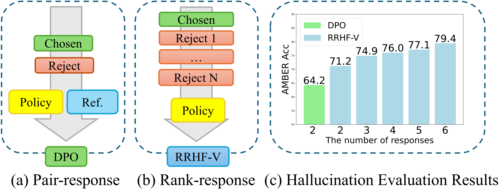

<div align="center">

# RRHF-V
**[COLING'25]RRHF-V: Ranking Responses to Mitigate Hallucinations in Multimodal Large Language Models with Human Feedback**

<a href='https://aclanthology.org/2025.coling-main.454/'></a>
</div>





## Abstract
Multimodal large language models (MLLMs) demonstrate strong capabilities in multimodal understanding, reasoning, and interaction but still face the fundamental limitation of hallucinations, where they generate erroneous or fabricated information. To mitigate hallucinations, existing methods annotate pair-responses (one non-hallucination vs one hallucination) using manual methods or GPT-4V, and train alignment algorithms to improve the correspondence between images and text. More critically, an image description often involve multiple dimensions (e.g., object attributes, posture, and spatial relationships), making it challenging for the model to comprehensively learn multidimensional information from pair-responses. To this end, in this paper, we propose RRHFV, which is the first using rank-responses (one non-hallucination vs multiple ranking hallucinations) to mitigate multimodal hallucinations. Instead of using pair-responses to train the model, RRHF-V expands the number of hallucinatory responses, so that the responses with different scores in a rank-response enable the model to learn rich semantic information across various dimensions of the image. Further, we propose a scene graph-based approach to automatically construct rank-responses in a cost-effective and automatic manner. We also design a novel training objective based on rank loss and margin loss to balance the differences between hallucinatory responses within a rankresponse, thereby improving the model’s image comprehension. Experiments on two MLLMs of different sizes and four widely used benchmarks demonstrate that RRHF-V is effective in mitigating hallucinations and outperforms the DPO method based on pair-responses.


## Environment Setup

```
conda create -yn rrhf-v python=3.9
conda activate rrhf-v
git clone https://github.com/chengq1001/RRHF-V.git --depth 1 && cd RRHF-V
pip install -r requirements.txt
```


## Train

llava-1.5-7b
```
python3 RRHF-V_llava-v1_5-7b-hf.py
```

tiny-llava-1b
```
python3 RRHF-V_llava-v1_5-7b-hf.py
```

## Core Contributors
We sincerely thank the core contributors for their dedication and outstanding contributions!
<table>
  <tr>
    <td align='center'>
      
      <br>
      <b>Guoqing Chen</b>
      <br>
        <a href='https://github.com/chengq1001'>chen.guoqing@bytedance.com</a>
    </td>
    <td align='center'>
      
      <br>
      <b>Jinghao Lin</b>
      <br>
        <a href='https://github.com/linjh1118'>linjinghao@bytedance.com</a>
    </td>
</table>


## Citation

If you find our model/code/data/paper helpful, please consider cite our papers 📝 and star us ⭐️！

```bibtex
@inproceedings{chen-etal-2025-rrhf,
    title = "{RRHF}-{V}: Ranking Responses to Mitigate Hallucinations in Multimodal Large Language Models with Human Feedback",
    author = "Chen, Guoqing  and
      Zhang, Fu  and
      Lin, Jinghao  and
      Lu, Chenglong  and
      Cheng, Jingwei",
    editor = "Rambow, Owen  and
      Wanner, Leo  and
      Apidianaki, Marianna  and
      Al-Khalifa, Hend  and
      Eugenio, Barbara Di  and
      Schockaert, Steven",
    booktitle = "Proceedings of the 31st International Conference on Computational Linguistics",
    month = jan,
    year = "2025",
    address = "Abu Dhabi, UAE",
    publisher = "Association for Computational Linguistics",
    url = "https://aclanthology.org/2025.coling-main.454/",
    pages = "6798--6815",
}
```
